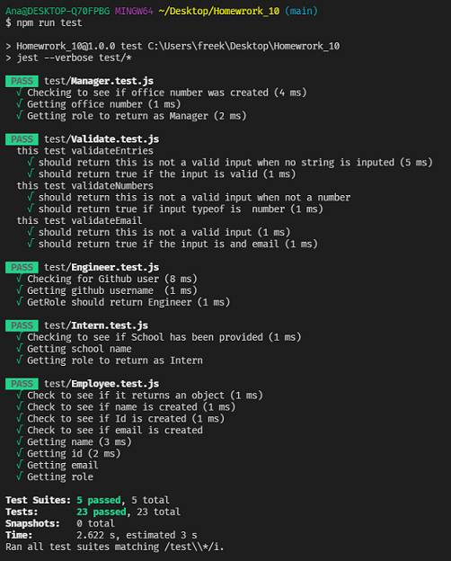

# Team Profile Generator

  ## Description:

  A Node.js command line application that takes information about employees & generates an HTML webpage with a summary of each role. 
  The application will prompt the user for information about the team members. The user can input as many employees as needed into the data.
  When the user has completed building the team, the application will create an HTML with the provided information.

  ### Table of Contents:

- [Installation](#installation)
- [Usage](#usage)
- [Tests](#testing)
- [Questions](#additional-info)

  ## Installation:
  - Download Node.js (if you don't already have it)
  - Open node.js in terminal.You will need the following dependencies
  - npm install inquirer
  - npm install --save-dev jest
  

  ## Usage:
 It will prompt the user queations to help them build their team. Questions consist of a "Manager", "Engineer", & "Intern" roles.
 The user is able to add as many team memebers as necessary.
 - User Result should look like this:
  

  ## Testing:
  - Open Terminal
  - Run this command on your terminal: npm run test
  - After you pass all test, run this command on your terminal: node (name of file you're running your questions).js
  - Follow prompts in the terminal 
  - Click on your html file & open it in your default browser
   

  ## Demo Video
    
  * Tutorial Video (Jest) [here](https://drive.google.com/file/d/1WEXhgjFK8QCKn3IVQzAgxF467vZObyqa/view) 
  * Tutorial Video (Inquirer) [here](https://drive.google.com/file/d/1Jawx6EsjYnZad1TErZG0GbXnD_9AnmtQ/view)
  
  ## Additional Info:
  :octocat: [Ana Abad](https://github.com/abanae)
  - Email: https://github.com/abanae 
  